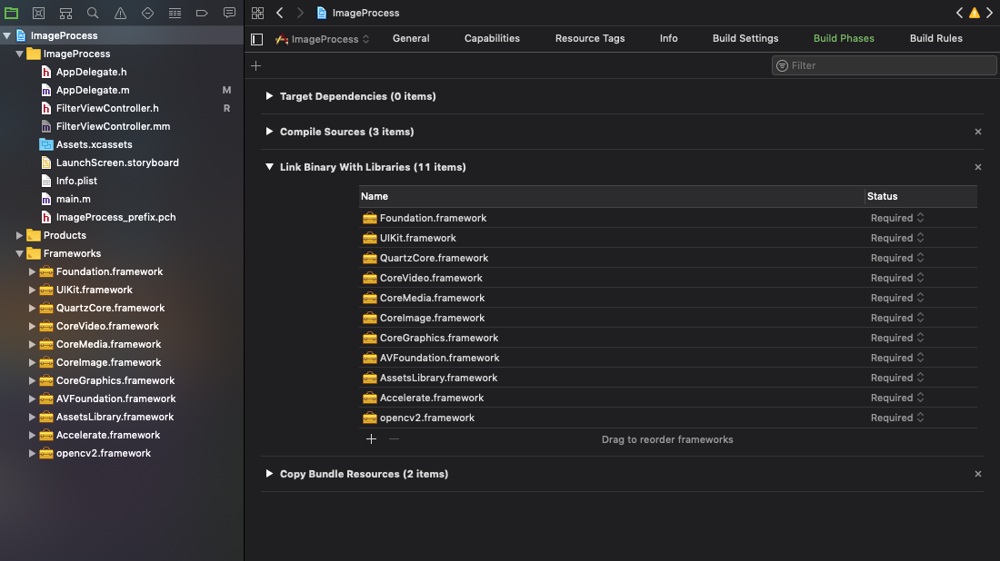
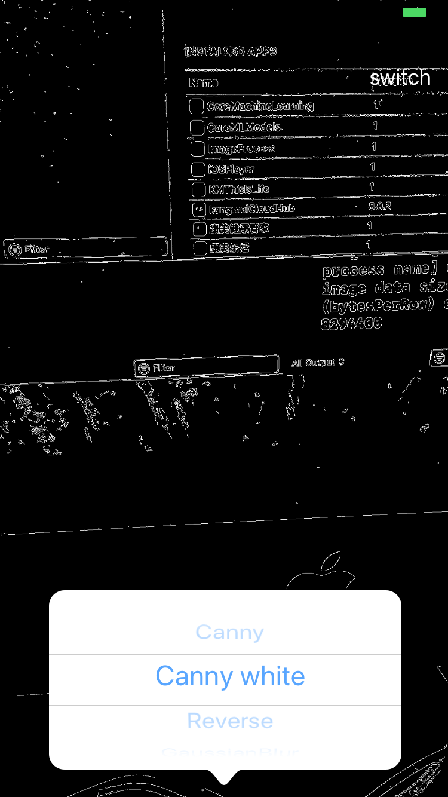
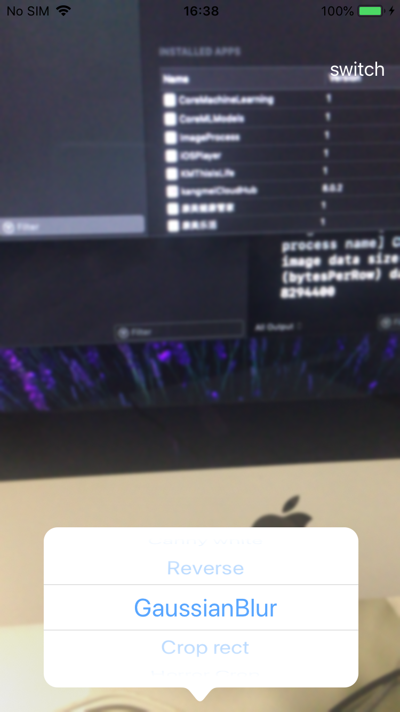
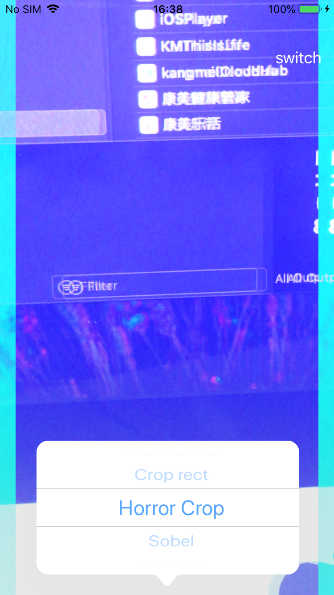
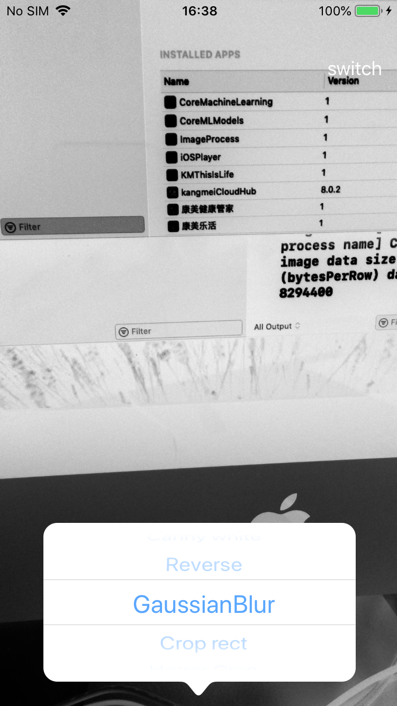
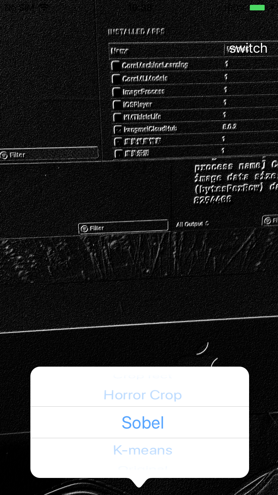

# LearningOpenCV in iOS

* To build yourself a opencv2.framework,follow this instruction:

In MacOS it can be done using the following command in Terminal:

```
cd ~/<my_working _directory>
git clone https://github.com/opencv/opencv.git
```
Building OpenCV from Source, using CMake and Command Line

Make symbolic link for Xcode to let OpenCV build scripts find the compiler, header files etc.
```
cd /
sudo ln -s /Applications/Xcode.app/Contents/Developer Developer
```

Build OpenCV framework:
```
cd ~/<my_working_directory>
python opencv/platforms/ios/build_framework.py ios
```
If everything's fine, a few minutes later you will get /<my_working_directory>/ios/opencv2.framework. You can add this framework to your Xcode projects.


### If you want to create your own iOS projects
* Remember to add this import code to your .pch file
```
#ifdef __cplusplus
#import <opencv2/opencv.hpp>
#endif
```

* Add the following frameworks in your project:

  * opencv2
  * Accelerate
  * AssetsLibrary
  * AVFoundation
  * CoreGraphics
  * CoreImage
  * CoreMedia
  * CoreVideo
  * QuartzCore
  * UIKit
  * Foundation


## ImageProcess

#### canny

#### canny white

#### gaussian blur

#### horror crop

#### reverse

#### sobel

